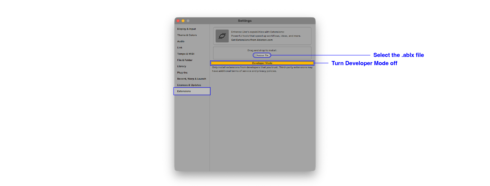

# philtzjp/live-connector


live-connector は、Ableton Live を AI エージェントから操作するための MCP サーバーです。

配布済みの `.ablx` を Ableton Live にインストールすると、Live 起動時に `http://127.0.0.1:7799/api/v1/mcp` で MCP endpoint が起動します。Claude Code などの MCP クライアントから、Live Set のトラック、クリップ、デバイス、MIDI ノート、デバイスパラメータを読み書きできます。

> live-connector is an MCP server for controlling Ableton Live from AI agents. Install the `.ablx` file, restart Live, and connect your MCP client to `http://127.0.0.1:7799/api/v1/mcp`.

## 必要なもの

- Ableton Live（Extensions 対応の Beta ビルド）
- [live-connector v2.0.1](https://github.com/philtzjp/live-connector/releases/tag/v2.0.1) の `.ablx`
- Claude Code などの HTTP MCP クライアント

## インストール

1. [`live-connector-2.0.1.ablx`](https://github.com/philtzjp/live-connector/releases/download/v2.0.1/live-connector-2.0.1.ablx) をダウンロードします。
2. Ableton Live を起動し、Preferences → Extensions を開きます。
3. `Choose file` から `.ablx` を選択、または `.ablx` を Extensions ページへドロップします。
4. Developer Mode を OFF にします。
5. Ableton Live を再起動します。



Live 起動後、ブラウザで次の URL を開きます。

<http://127.0.0.1:7799/health>

ページに次のような JSON が表示されれば、live-connector は起動しています。

```json
{"status":"pass","version":"2.0.1","description":"live-connector MCP server"}
```

## Claude Code で使う

初回のみ、プロジェクトルートで MCP server を登録します。

```sh
claude mcp add --transport http live-connector http://127.0.0.1:7799/api/v1/mcp --scope project
```

登録後に Claude Code を再起動します。URL が変わらない限り、`.ablx` の再インストールや Live 再起動のたびに再登録する必要はありません。

## できること

- Live Set の概要取得: `get_overview`
- Live Object Model のスキーマ確認: `schema`
- Cypher サブセットによる読み取り: `query`
- トラック、クリップ、シーン、デバイスパラメータ、Cue Point の更新
- Session / Arrangement クリップの作成と削除
- MIDI ノートの書き込み
- Arrangement 範囲のオーディオ書き出し
- デバイス状態の保存と再適用

例:

```cypher
MATCH (:Track {name:"Drums"})-[:HAS_DEVICE]->(:Device {name:"Operator"})-[:HAS_PARAM]->(p:Parameter {name:"Cutoff"})
RETURN p.value, p.min, p.max
```

## 注意点

- インストール済み `.ablx` を使う場合、Developer Mode は OFF にします。
- `localhost:7799` が起動しない場合は、Ableton Live を再起動し、`/health` を確認してください。
- v2.0.0 で `localhost:7799` が起動しない場合は、v2.0.1 以降の `.ablx` に更新してください。
- Ableton Extensions SDK v1.0.0-beta.0 には Browser API がないため、`.adv` / `.adg` / third-party plug-in のネイティブプリセットを Live へ直接読み込むことはできません。
- third-party plug-in の非公開内部状態や波形選択は保存・復元できません。`save_device_state` / `apply_device_state` の対象は SDK から見える host 公開パラメータに限定されます。

## ライセンス

本リポジトリの自作コード・ドキュメント・アセットは [MIT](./LICENSE) です。

Ableton Extensions SDK は Ableton AG の第三者コンポーネントであり、本リポジトリには同梱していません。詳細は [LICENSE](./LICENSE) の Third-Party Components を参照してください。
