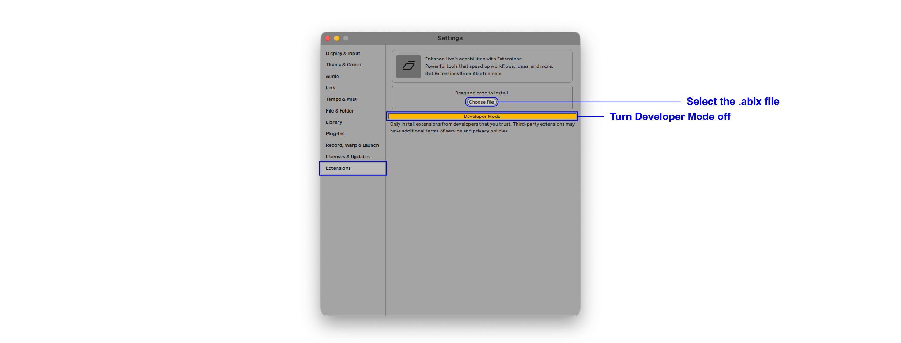

# philtzjp/live-connector


live-connector は、Ableton Live を AI エージェントから操作するための MCP サーバーです。

配布済みの `.ablx` を Ableton Live にインストールすると、Live 起動時に `http://127.0.0.1:7799/api/v1/mcp` で MCP endpoint が起動します。Claude Code などの MCP クライアントから、Live Set のトラック、クリップ、デバイス、MIDI ノート、デバイスパラメータを読み書きできます。

> live-connector is an MCP server for controlling Ableton Live from AI agents. Install the `.ablx` file, restart Live, and connect your MCP client to `http://127.0.0.1:7799/api/v1/mcp`.

## 必要なもの

- Ableton Live（Extensions 対応の Beta ビルド）
- 本リポジトリの `.ablx`（[Releases](https://github.com/philtzjp/live-connector/releases) から取得、または `pnpm package` で生成）
- Claude Code などの HTTP MCP クライアント
- （任意）Main 出力の実時間録音を使う場合は AbletonOSC を Remote Script として導入

## インストール

1. `live-connector-3.2.0.ablx` を用意します（Releases からダウンロード、またはリポジトリで `pnpm package` を実行）。
2. Ableton Live を起動し、Preferences → Extensions を開きます。
3. `Choose file` から `.ablx` を選択、または `.ablx` を Extensions ページへドロップします。
4. Developer Mode を OFF にします。
5. Ableton Live を再起動します。



Live 起動後、ブラウザで次の URL を開きます。

<http://127.0.0.1:7799/health>

ページに次のような JSON が表示されれば、live-connector は起動しています。

```json
{"status":"pass","version":"3.2.0","description":"live-connector MCP server","tools":{ ... },"structure":{ ... }}
```

## Claude Code で使う

初回のみ、プロジェクトルートで MCP server を登録します。

```sh
claude mcp add --transport http live-connector http://127.0.0.1:7799/api/v1/mcp --scope project
```

登録後に Claude Code を再起動します。URL が変わらない限り、`.ablx` の再インストールや Live 再起動のたびに再登録する必要はありません。

## できること

v3.0.0 では MCP ツールが 4 つに統合されています。推奨フローは **meta → do read → do write → render → undo** です。

| 動詞 | ツール | できること |
| --- | --- | --- |
| 入口 | `meta` | サービス情報、LOM スキーマ、Cypher 文法契約、CALL 手続き、capabilities、例文、Live Set overview |
| 見る・変える | `do` | Cypher で読み取り（MATCH … RETURN）と書き込み（SET / CREATE / DELETE / COPY）、Transport 手続き（CALL） |
| 聴く | `render` | AudioTrack の Pre-FX レンダリング、または Main 出力の実時間録音（`source:"main"`） |
| 戻す | `undo` | do 書き込みの取り消し（LIFO）。履歴は `do` read の `WriteEvent` 仮想ラベルで照会 |

読み取り例:

```cypher
MATCH (:Track {name:"Drums"})-[:HAS_DEVICE]->(:Device {name:"Operator"})-[:HAS_PARAM]->(p:Parameter {name:"Cutoff"})
RETURN p.value, p.min, p.max
```

書き込み例:

```cypher
MATCH (t:Track {name:"Drums"}) SET t.mute = true
```

```cypher
CREATE (t:MidiTrack {name:"Bass"})
```

```cypher
MATCH (t:MidiTrack {name:"Bass"}) CREATE (t)-[:HAS_DEVICE]->(d:Device {name:"Wavetable"})
```

内蔵デバイスの挿入は `index` を省略するとデバイスチェーンの末尾へ挿入します。Rack のチェーン内へ挿入する場合は `MATCH (:Device)-[:HAS_CHAIN]->(ch:Chain)` をアンカーにします。読み込めるのは Live の内蔵デバイスのみで、サードパーティ製プラグインは SDK 上扱えません。

## Transport の操作（AbletonOSC）

`do` の限定 `CALL` で再生・停止・シークと録音ジョブの中断を要求できます。許可手続きとリテラル引数のみを受理し、`confirm:true` が必要です。`preview:true` は OSC 送信を含め副作用がありません。

```cypher
CALL transport.seek(32)
```

```cypher
CALL transport.play()
```

```cypher
CALL render.cancel("render-xxxxx")
```

Transport の状態は仮想ラベル `Transport` で読み取ります（AbletonOSC 未接続時は 0 行）。

```cypher
MATCH (t:Transport) RETURN t.isPlaying, t.currentSongTime, t.tempo
```

これらを使うには AbletonOSC を Remote Script として導入し、`LIVE_CONNECTOR_OSC_ENABLED=true` を設定します（既定は無効）。OSC を使わなくても他の機能は動作します。

## Main 出力の録音（Hybrid）

MIDI 楽器の実音や Main 上の EQ / Compressor / Limiter を通した完成信号を、Resampling 入力の実時間録音で取得します。`render` に `source:"main"` を渡します。

1. まず実行計画を取得します（録音やトラック作成はしません）。

```json
{"source":"main","startTime":0,"endTime":64,"preview":true}
```

2. 返ってきた `planId` を使い、`requestId` と `confirm:true` を付けて実行します。実時間再生のため常に background ジョブです。

```json
{"source":"main","startTime":0,"endTime":64,"background":true,"confirm":true,"planId":"plan-...","requestId":"capture-001"}
```

3. 進捗と結果は `RenderJob` 仮想ラベルで照会します。

```cypher
MATCH (j:RenderJob {id:"render-xxxxx"}) RETURN j.phase, j.progressFraction, j.audioStatus, j.cleanupStatus, j.filePath
```

`startTime` / `endTime` は 0 始まりの四分音符拍です（4/4 で 0〜64 拍は 16 小節）。録音は一時 AudioTrack を作成し loop / punch / record_mode を一時変更し、終了後に復旧して一時トラックを削除します。録音中は他の書き込み・undo・別 render を実行しないでください。

## 注意点

- インストール済み `.ablx` を使う場合、Developer Mode は OFF にします。
- `localhost:7799` が起動しない場合は、Ableton Live を再起動し、`/health` を確認してください。
- v3.0.0 は **破壊的変更**です。v2.x の個別ツール名（`query` / `set_track` / `render_audio` 等）は存在しません。
- Ableton Extensions SDK v1.0.0-beta.1 には Browser API がないため、`.adv` / `.adg` / third-party plug-in のネイティブプリセットを Live へ直接読み込むことはできません。
- third-party plug-in の非公開内部状態や波形選択は保存・復元できません。デバイスパラメータの保存・復元は `do` read で Parameter 値を取得し、`do` SET で再適用してください（旧 `save_device_state` / `apply_device_state` は廃止）。
- SDK には MIDI 楽器トラックの合成出力を audio 化する手段がありません。`render` の `select` モードは AudioTrack の pre-FX 音声のみ対象です。MIDI 楽器の実音や Main のデバイスを通した完成信号は、`render` の `source:"main"`（AbletonOSC 必須）で Main 出力を実時間録音して取得します。個別の MIDI トラックを audio 化する従来手順は `llm/midi-audition.md` を参照してください。
- Main 録音は実時間で行われ、CPU 不足やドロップアウトの影響を受け得ます。テンポ変化・外部入力依存・無人運用は対応範囲外です。
- OSC を含む録音経路は実機検証が前提です。`meta` の `runtime.validationLevel` が `unverified` の間は実験的機能として扱ってください。
- AbletonOSC の OSC server は既定で `0.0.0.0` に bind し得ます。Remote Script の loopback bind 設定または OS firewall で UDP 受信を制限し、無認証 OSC を LAN へ公開しないでください。

## 開発

モノレポは pnpm + Turborepo で管理します。主なコマンド:

```sh
pnpm typecheck   # 全パッケージの型チェック
pnpm test        # vitest によるユニットテスト（実機・Ableton SDK 実体なしで完走）
pnpm lint        # Biome によるリント
pnpm format      # Biome によるフォーマット
```

`pnpm test` は `packages/cypher`（tokenizer / parser / evaluator / parseStatement）、`packages/lom-schema`（ラベル継承・サブタイプ判定）、`packages/json`（`bigint` を含む値の JSON 直列化）、`apps/extension`（フェイク SDK とフェイク MCP サーバーによる meta / do / undo / render ツール層）を検証します。

### git hook

git hook は `.vite-hooks/` にコミットしてあります。clone したら次を一度実行して有効化してください。`core.hooksPath` は `.git/config` に書かれるローカル設定なので、作業環境を作るたびに実行します。

```sh
git config core.hooksPath .vite-hooks
```

`commit-msg` はコミットメッセージの形式を、`pre-commit` は `.env*` が dotenvx で暗号化されていることを検査します。`pre-push` は `pnpm typecheck` と `pnpm test` を実行します。

## ライセンス

本リポジトリの自作コード・ドキュメント・アセットは [MIT](./LICENSE) です。

Ableton Extensions SDK は Ableton AG の第三者コンポーネントであり、本リポジトリには同梱していません。詳細は [NOTICE](./NOTICE) を参照してください。
