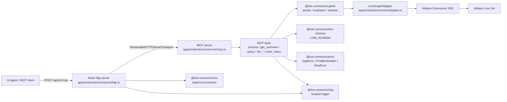
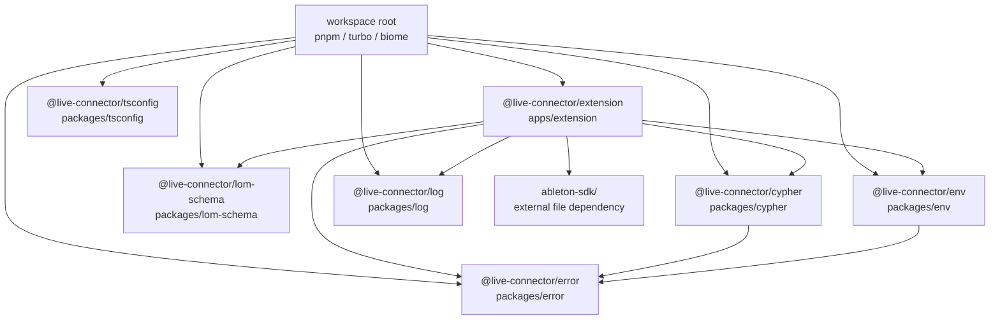
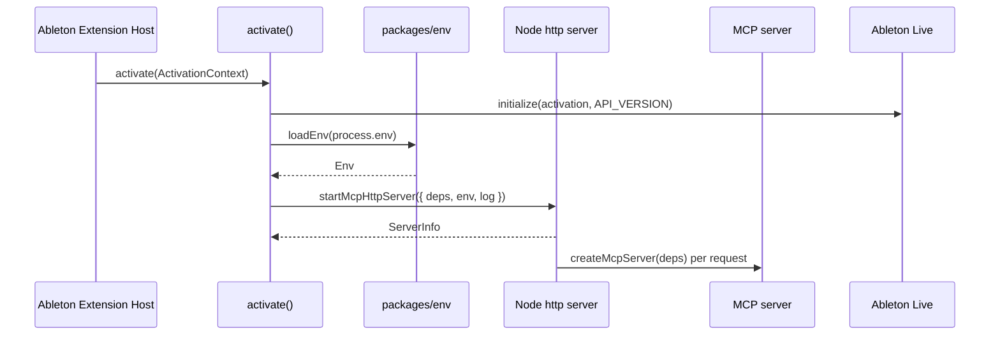
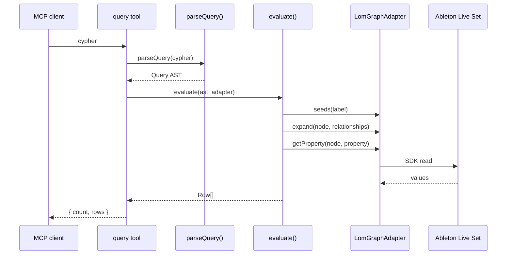
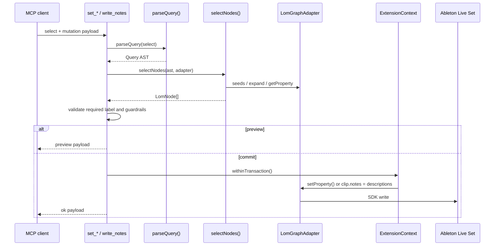
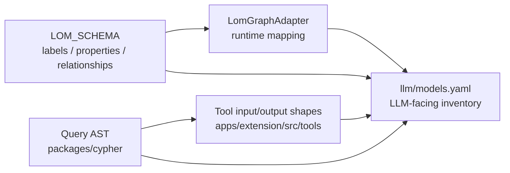

# live-connector Architecture

この文書は、現在の実装コードを基準に live-connector の構成、責務境界、実行時フローを記録する。データモデルの詳細は `llm/models.yaml` を正本とする。

## システム概要

live-connector は Ableton Extensions SDK 上で動作する Node.js extension である。Extension Host 内で Node.js 標準 `http` サーバーを起動し、`@modelcontextprotocol/sdk` 同梱の `StreamableHTTPServerTransport` 経由で MCP ツールを提供する。MCP ツールは Live Object Model (LOM) をプロパティグラフとして扱い、Cypher サブセットで読み取り、型付きツールで書き込みを行う。

## パッケージ境界

| パッケージ | 責務 |
| --- | --- |
| `apps/extension` | Ableton extension の起動、HTTP/MCP サーバー、MCP ツール登録、LOM adapter 実装 |
| `packages/cypher` | Cypher サブセットの tokenizer/parser/AST/evaluator。Ableton SDK へ依存しない |
| `packages/lom-schema` | LOM グラフスキーマ、ラベル、プロパティ、リレーション、例クエリの正本 |
| `packages/env` | 環境変数の zod 検証と型付き `Env` の提供 |
| `packages/error` | `AppError` 系のエラー定義、HTTP 用 RFC 9457 Problem Details 変換、MCP 用構造化エラー変換 |
| `packages/log` | scope 付き logger の生成と標準出力/標準エラーへの集約 |
| `packages/tsconfig` | 共有 TypeScript 設定 |

## 起動フロー

`activate()` は Ableton SDK の `initialize()` で `ExtensionContext` を得る。`loadEnv()` は host/port/token を検証し、`startMcpHttpServer()` は `/health` と `/api/v1/mcp` を公開する。`LIVE_CONNECTOR_MCP_TOKEN` が設定されている場合のみ、`/api/v1/mcp` に Bearer 認証が適用される。

## HTTP エンドポイント

| method | path | 認証 | 用途 |
| --- | --- | --- | --- |
| `GET` | `/health` | なし | `application/health+json` のヘルスチェック |
| `POST` | `/api/v1/mcp` | `LIVE_CONNECTOR_MCP_TOKEN` 設定時のみ Bearer | Streamable HTTP MCP endpoint |

## MCP ツール

| tool | 種別 | 説明 |
| --- | --- | --- |
| `schema` | read | `LOM_SCHEMA` と `EXAMPLE_QUERIES` を返す |
| `get_overview` | read | tempo、scale、track 概要、scene/cue count を返す |
| `query` | read | Cypher サブセットを parse/evaluate して行集合を返す |
| `set_song` | write | Song の `tempo` を書き込む |
| `set_track` | write | Track の `name` / `arm` / `mute` / `solo` を書き込む |
| `set_clip` | write | Clip / AudioClip の mutable property を書き込む |
| `set_scene` | write | Scene の `name` を書き込む |
| `set_device_parameter` | write | Parameter の `value` を書き込む |
| `write_notes` | write | 1 つの MidiClip の notes を replace する |

## 読み取りフロー

`packages/cypher` は SDK 非依存の `GraphAdapter<N>` 越しにグラフを評価する。`LomGraphAdapter` は Ableton SDK の `Song` / `Track` / `Clip` / `Device` / `DeviceParameter` / `NoteDescription` を `LomNode` として包み、LOM schema に定義されたラベルとプロパティへ変換する。

## 書き込みフロー

書き込み系 `select` は対象ノード集合を解決する selector であり、`RETURN` は単一ノード変数に限定される。`set_*` は対象件数が `CONFIRM_THRESHOLD` を超える場合に `confirm:true` を要求する。`write_notes` はちょうど 1 つの `MidiClip` を要求し、notes を replace する。

## データ所有

`llm/models.yaml` は実装の代替ではなく、LLM が参照するモデル目録である。TypeScript 型や zod schema を変更した場合は、対応する項目を更新する。

## 現在の制約

- MCP tool error は `toMcpError()` により `{ error, detail, hint?, validProperties?, validRelationships?, validStartLabels? }` 形式で返る。HTTP の `status` / `type` / `instance` は MCP tool error には含めない。
- HTTP 層のエラーは `toProblemDetails()` により RFC 9457 Problem Details 形式を維持する。
- `query` の `RETURN` は射影を許可するが、書き込み系 `select` の `RETURN` は単一ノード変数に限定される。
- Cypher サブセットは `MATCH ... [WHERE ...] RETURN ... [LIMIT n]`、有向 relationship、可変長 hop、基本比較演算を対象にする。
- `LomGraphAdapter.seeds()` で開始できるラベルは `Song` / `Track` family / `Clip` family / `Device` family / `Scene` / `CuePoint` である。
- `ableton-sdk/` は外部配布物であり、workspace には同梱しない。
