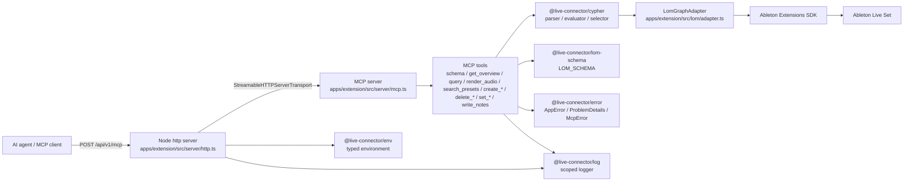
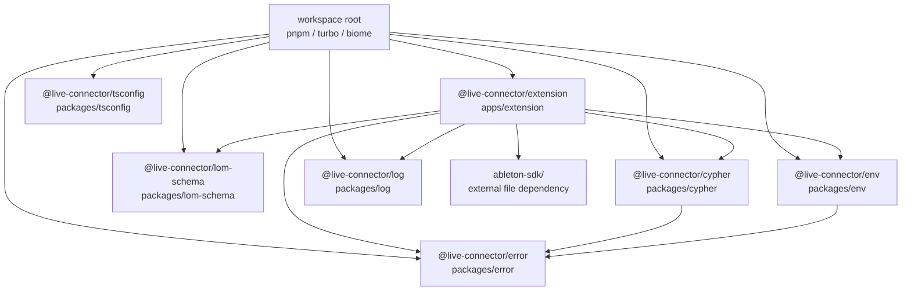
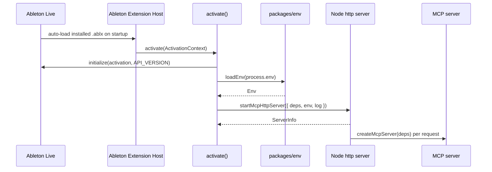
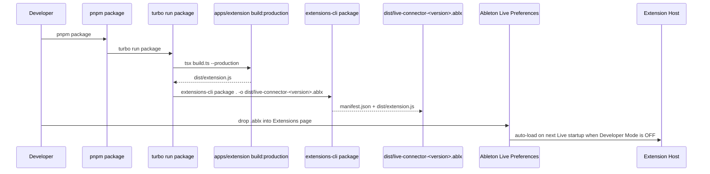
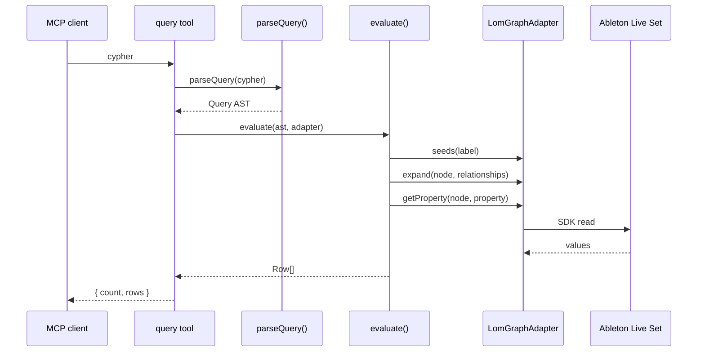
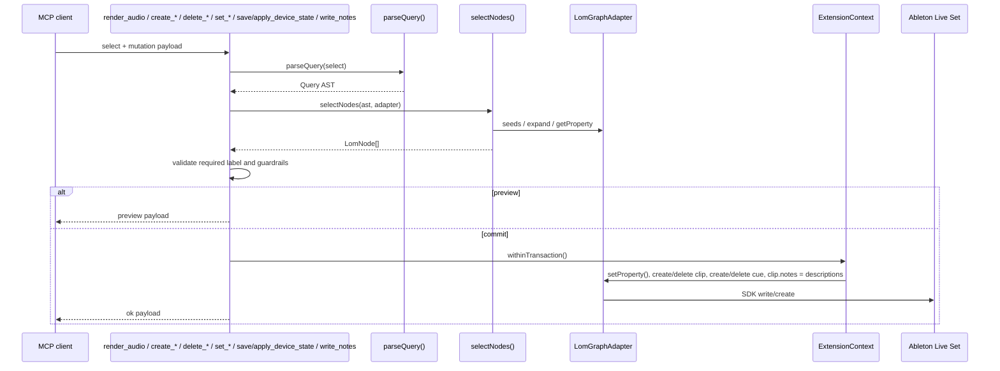
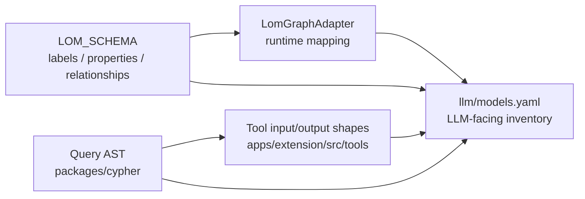

# live-connector Architecture

この文書は、現在の実装コードを基準に live-connector の構成、責務境界、実行時フローを記録する。データモデルの詳細は `llm/models.yaml` を正本とする。

## システム概要

live-connector は Ableton Extensions SDK 上で動作する Node.js extension である。Extension Host 内で Node.js 標準 `http` サーバーを起動し、`@modelcontextprotocol/sdk` 同梱の `StreamableHTTPServerTransport` 経由で MCP ツールを提供する。MCP ツールは Live Object Model (LOM) をプロパティグラフとして扱い、Cypher サブセットで読み取り、型付きツールで書き込みを行う。

## パッケージ境界

| パッケージ | 責務 |
| --- | --- |
| `apps/extension` | Ableton extension の起動、HTTP/MCP サーバー、MCP ツール登録、LOM adapter 実装 |
| `packages/cypher` | Cypher サブセットの tokenizer/parser/AST/evaluator。Ableton SDK へ依存しない |
| `packages/lom-schema` | LOM グラフスキーマ、ラベル、プロパティ、リレーション、例クエリの正本 |
| `packages/env` | 環境変数の zod 検証と型付き `Env` の提供 |
| `packages/error` | `AppError` 系のエラー定義、HTTP 用 RFC 9457 Problem Details 変換、MCP 用構造化エラー変換 |
| `packages/log` | scope 付き logger の生成と標準出力/標準エラーへの集約 |
| `packages/tsconfig` | 共有 TypeScript 設定 |

## 起動フロー

インストール型運用では Developer Mode を OFF にし、Live が管理する Extension Host がインストール済み `.ablx` を Live 起動時に自動ロードする。開発モードでは Developer Mode を ON にし、Live が管理する host を停止したうえで `extensions-cli run`（`pnpm --filter @live-connector/extension start` 経由）を使って開発者が Extension Host を起動する。

`activate()` は Ableton SDK の `initialize()` で `ExtensionContext` を得る。`loadEnv()` は loopback host と port を検証し、`startMcpHttpServer()` は `/health` と `/api/v1/mcp` を公開する。`/api/v1/mcp` は Host header が loopback host と設定 port に一致し、Origin header が存在する場合は loopback origin であるリクエストのみ受け付ける。

## 運用モード

| モード | Developer Mode | 起動主体 | 用途 | 変更反映 |
| --- | --- | --- | --- | --- |
| インストール型 | OFF | Ableton Live / Extension Host | 通常利用。CLI 起動不要 | `.ablx` 再インストール + Live 再起動 |
| 開発モード | ON | `extensions-cli run` | build 後の高速リロード | `pnpm --filter @live-connector/extension start` |

Claude Code は project scope の HTTP MCP server として `claude mcp add --transport http live-connector http://127.0.0.1:7799/api/v1/mcp --scope project` で登録する。登録または URL 変更などの MCP 設定変更後は Claude Code 再起動が必要である。Live 再起動や `.ablx` 再インストールのみで URL が変わらない場合、Claude Code は同じ endpoint に再接続する。

## 配布フロー

`pnpm package` は root script から Turborepo の `package` task を実行する。`@live-connector/extension` の package script は production bundle を生成した後、`manifest.json` の `name` と `version` から `.ablx` の出力名を決め、SDK CLI の `extensions-cli package` に渡す。`.ablx` は `apps/extension/dist/` に生成される。インストール型運用では、生成済み `.ablx` を Ableton Live の Preferences → Extensions にドロップし、Developer Mode OFF の状態で Live を再起動する。

## HTTP エンドポイント

| method | path | 認証 | 用途 |
| --- | --- | --- | --- |
| `GET` | `/health` | なし | `application/health+json` のヘルスチェック |
| `POST` | `/api/v1/mcp` | loopback Host / Origin header 検証 | Streamable HTTP MCP endpoint |

## MCP ツール

| tool | 種別 | 説明 |
| --- | --- | --- |
| `schema` | read | `LOM_SCHEMA` と `EXAMPLE_QUERIES` を返す |
| `get_overview` | read | tempo、scale、track 概要、アレンジクリップ、CuePoint、scene/cue count を返す |
| `query` | read | Cypher サブセットを parse/evaluate して行集合を返す |
| `get_write_history` | read | 書き込みツールの実行履歴（時刻・ツール名・入力要約・結果）を新しい順に取得する |
| `verify_device_catalog` | test | 内蔵デバイスカタログ全項目を一時トラックへ挿入試行し挿入可否一覧を返す（Set に残留しない） |
| `render_audio` | read/render | 1 つの AudioTrack の arrangement pre-FX 音声を WAV にレンダリングしてパスを返す |
| `search_presets` | read/fs | 指定 root 配下のプリセット候補ファイルを列挙する。適用は行わない |
| `create_arrangement_clip` | write | 1 つの MidiTrack / AudioTrack に arrangement Clip を startTime/duration 指定で作成する |
| `delete_arrangement_clip` | write | 1 つの arrangement Clip を削除する |
| `create_cue_point` | write | time 指定で CuePoint を作成し、任意で `name` を設定する |
| `delete_cue_point` | write | 1 つの CuePoint を削除する |
| `create_clip` | write | 空の ClipSlot にセッションクリップを生成する（MidiTrack は length で空 MidiClip、AudioTrack は audioFilePath で AudioClip） |
| `create_track` | write | MIDI / Audio トラックを生成する（SDK 制約で挿入位置は末尾／選択直後） |
| `create_scene` | write | index 指定で空の Scene を作成する |
| `delete_scene` | write | 1 つの Scene を削除する（confirm 必須） |
| `duplicate_scene` | write | 1 つの Scene を複製する |
| `delete_track` | write | 1 つの regular Track を削除する（confirm 必須、return/main 不可） |
| `duplicate_track` | write | 1 つの regular Track を複製する |
| `delete_device` | write | 1 つの Device を親 Track/Chain から削除する（confirm 必須） |
| `duplicate_device` | write | 1 つの Device を複製する |
| `delete_session_clip` | write | 1 つの ClipSlot のセッションクリップを削除する（confirm 必須） |
| `transform_notes` | write | 1 つの MidiClip の notes を決定的変換する（transpose/shift/velocity/quantize/duplicate） |
| `set_song` | write | Song の `tempo` を書き込む |
| `set_track` | write | Track の `name` / `arm` / `mute` / `solo` を書き込む |
| `set_clip` | write | Clip / AudioClip の mutable property を書き込む |
| `set_scene` | write | Scene の `name` を書き込む |
| `set_cue_point` | write | CuePoint の `name` を書き込む |
| `set_device_parameter` | write | Parameter の `value` を書き込む |
| `save_device_state` | write/fs | 1 つの Device の公開 DeviceParameter 値を `environment.storageDirectory` に JSON 保存する |
| `apply_device_state` | write/fs | 保存済み DeviceParameter 値を 1 つの Device の同名パラメータへ再適用する |
| `load_sample` | write/fs | 1 つの Simpler に importIntoProject + replaceSample でオーディオを読み込む |
| `write_notes` | write | 1 つの MidiClip の notes を replace / merge / clear_range する |
| `batch` | write | 複数の書き込み（set_* / write_notes）を 1 つの undo ステップで実行する |
| `restore_snapshot` | write | snapshotId を指定して set_* / write_notes の変更前の値へ書き戻す |
| `list_snapshots` | read | 保存済みスナップショット（id / 時刻 / ツール / 種別 / select）を新しい順に取得する |

## MCP メタデータ

`createMcpServer` は initialize 応答の `instructions` に運用規約の要約（推奨手順 schema→query→preview→confirm、時刻座標の 2 系統、ガードレール、ミキサー Parameter 経路）を設定する。ツールには `withToolAnnotations` facade で `TOOL_ANNOTATIONS`（`apps/extension/src/server/annotations.ts`）に基づく annotations を注入する: read 系は `readOnlyHint`、`delete_*` は `destructiveHint`、`set_*` / `apply_device_state` / `restore_snapshot` は `idempotentHint`。facade はツール名・ハンドラを変えないため `tools/list` と `describeRegisteredTools` に影響しない。ミキサーの volume / panning / send は `(Track)-[:HAS_MIXER]->(Mixer)-[:HAS_VOLUME|HAS_PAN|HAS_SEND]->(Parameter)` として `set_device_parameter` で書き込む（`set_track` へ直接追加しない設計）。

## 読み取りフロー

`packages/cypher` は SDK 非依存の `GraphAdapter<N>` 越しにグラフを評価する。`LomGraphAdapter` は Ableton SDK の `Song` / `Track` / `Clip` / `Device` / `DeviceParameter` / `NoteDescription` を `LomNode` として包み、LOM schema に定義されたラベルとプロパティへ変換する。

## 書き込みフロー

単一対象ツールの `select` は対象ノード集合を解決する selector であり、`RETURN` は単一ノード変数に限定される。`render_audio` はちょうど 1 つの `AudioTrack` を要求し、指定 beat 範囲の arrangement pre-FX 音声を WAV として生成する。`create_arrangement_clip` はちょうど 1 つの `MidiTrack` または `AudioTrack` を要求し、arrangement timeline に `startTime` / `duration` 指定で clip を作成する。`delete_arrangement_clip` は `HAS_ARRANGEMENT_CLIP` で辿れる clip だけを削除し、session clip は対象外とする。`create_cue_point` / `delete_cue_point` は Song の CuePoint を作成・削除する。`create_clip` はちょうど 1 つの空 `ClipSlot` を要求し、親が `MidiTrack` である場合のみ空 `MidiClip` を生成する。`set_*` は対象件数が `CONFIRM_THRESHOLD` を超える場合に `confirm:true` を要求する。`set_cue_point` は `CuePoint.name` を書き込む。`save_device_state` / `apply_device_state` はちょうど 1 つの `Device` を要求し、公開 `DeviceParameter` の値だけを JSON 保存・再適用する。`write_notes` はちょうど 1 つの `MidiClip` を要求し、notes を replace する。

## 一括書き込み（batch）

`ExtensionContext.withinTransaction(fn)` はネストすると最外へ統合され 1 undo ステップになるが、コールバックは同期でなければならず（内部で await 不可）、`Promise.all([...])` を返すことで複数の非同期ミューテーションを 1 ステップにまとめる。この制約から `batch` は「全ステップの対象を先に非同期で解決・検証（all-or-nothing）→ 全ミューテーションを 1 つの同期 `withinTransaction` コールバック内で初期化」する。対象は `set_*` と `write_notes` のように「解決後に同期適用できる」書き込みに限る。同期コールバック内で await できないため、後続ステップは同一 batch 内で先行ステップが作成したオブジェクトを参照できず、構造操作（create / delete / duplicate）は本ツールの対象外。いずれかのステップが解決・検証に失敗した場合は何も適用せず失敗ステップを返す。

## 巻き戻し（スナップショット）

SDK v1.0.0-beta.0 には undo / redo を実行する API が無い（`ExtensionContext` はトランザクションの undoable 性を記述するのみ）。このため `set_*` / `write_notes` は適用直前に旧値を `environment.storageDirectory/snapshots/<id>.json` へスナップショットし、応答に `snapshotId` を返す。`restore_snapshot` は `select` を再解決して旧プロパティ値 / 旧 notes を書き戻す。復元は best-effort であり、対象が削除・移動されている場合や select が異なる件数にマッチする場合は部分的・不可となる。構造操作（create / delete / duplicate）や `move_clip` / `trim_clip` の非可逆属性はこの機構の対象外。保持は最新 `MAX_SNAPSHOTS`(100) 件でローテーションする。upstream（Ableton Extensions SDK）への undo / redo API 追加要望は本機構の前提であり、追加され次第この代替を置き換える。

## データ所有

`llm/models.yaml` は実装の代替ではなく、LLM が参照するモデル目録である。TypeScript 型や zod schema を変更した場合は、対応する項目を更新する。

## 書き込み履歴

`createMcpServer` は `withWriteHistory` facade を通してツールを登録する。facade は `WRITE_HISTORY_TOOLS` に含まれる書き込みツールのハンドラをラップし、結果が `status:"ok"` の実書き込みのみ `environment.storageDirectory/history/write-history.jsonl` へ JSONL 追記する（preview / confirm_required / error は記録しない）。ツール名は変えないため `tools/list` と `describeRegisteredTools` に影響しない。`get_write_history` は件数・時刻範囲でこの履歴を取得し、ホスト再起動をまたいで参照できる。上限（`MAX_HISTORY_BYTES`）超過時は末尾 `MAX_HISTORY_ENTRIES` 件へローテーションする。

## 現在の制約

- MCP tool error は `toMcpError()` により `{ error, detail, hint?, validProperties?, validRelationships?, validStartLabels? }` 形式で返る。HTTP の `status` / `type` / `instance` は MCP tool error には含めない。
- HTTP 層のエラーは `toProblemDetails()` により RFC 9457 Problem Details 形式を維持する。
- `query` の `RETURN` は射影を許可するが、書き込み系 `select` の `RETURN` は単一ノード変数に限定される。
- `Clip.startTime` / `startMarker` / `endMarker` / `loopStart` / `loopEnd` は SDK 上 read-only であり、arrangement clip の移動・トリムは直接ツール化しない。必要な場合は削除と再作成で表現する。
- Ableton Extensions SDK には Browser API とネイティブプリセット読込 API が無いため、`search_presets` はファイル列挙のみを行う。`.adv` / `.adg` / third-party plug-in preset の適用は対象外とする。
- Device state snapshot は SDK に公開される `DeviceParameter` の値だけを対象とし、plug-in の非公開内部状態は保存・復元しない。
- Cypher サブセットは `MATCH ... [WHERE ...] RETURN ... [LIMIT n]`、有向 relationship、可変長 hop、基本比較演算を対象にする。
- `LomGraphAdapter.seeds()` で開始できるラベルは `Song` / `Track` family / `Clip` family / `Device` family / `Scene` / `CuePoint` である。
- `ableton-sdk/` は外部配布物であり、workspace には同梱しない。
- SDK は Live Set の名称・ファイルパスを公開しない（`Environment` は language / storageDirectory / tempDirectory のみ、`Song` / `Application` に name / path getter は無い）。接続先の変化は `get_overview` / `/health` の構造ダイジェストと `songHandle` の変化で検知する。push 型のイベント通知は SDK 非対応。
